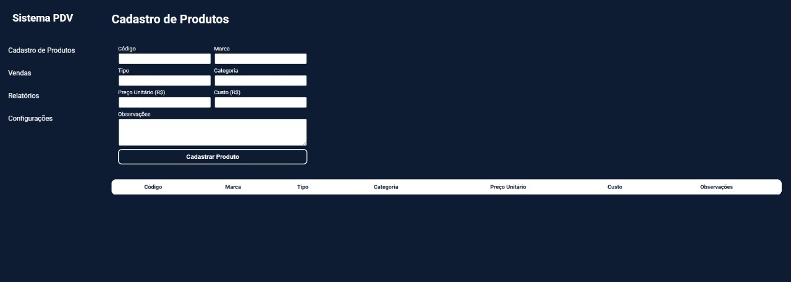

# 🧾 Sistema PDV - Lucas Vitor

Este projeto consiste em um sistema web simples de PDV (Ponto de Venda) desenvolvido com HTML, CSS e JavaScript, com um script Python para automação de cadastro de produtos através da interface gráfica do navegador.

## 🌐 Interface Web

A aplicação web apresenta um layout moderno e responsivo para **cadastro de produtos**, com formulário, tabela dinâmica e navegação lateral. Todos os dados inseridos são exibidos na tabela logo abaixo do formulário.

<div>
    
</div>

### Funcionalidades:
- Cadastro de produtos com os seguintes campos:
  - Código
  - Marca
  - Tipo
  - Categoria
  - Preço Unitário
  - Custo
  - Observações
- Tabela dinâmica com exibição imediata dos produtos
- Layout responsivo com navegação lateral

## 🤖 Automação com PyAutoGUI

A automação é feita com **Python** utilizando a biblioteca `PyAutoGUI`, que lê os dados de um arquivo `.csv` e insere automaticamente na interface do sistema PDV hospedado online.

### Funcionalidades do script:
- Abertura automática do navegador e acesso à URL do sistema (`https://pdv-gilt.vercel.app/`)
- Leitura de dados a partir do arquivo `dba.csv`
- Preenchimento automático de campos do formulário com:
  - Código
  - Marca
  - Tipo
  - Categoria
  - Preço Unitário
  - Custo
  - Observações (opcional)
- Clique no botão "Cadastrar Produto"

### Dependências:
Certifique-se de instalar as bibliotecas abaixo:

```bash
pip install pyautogui pandas
